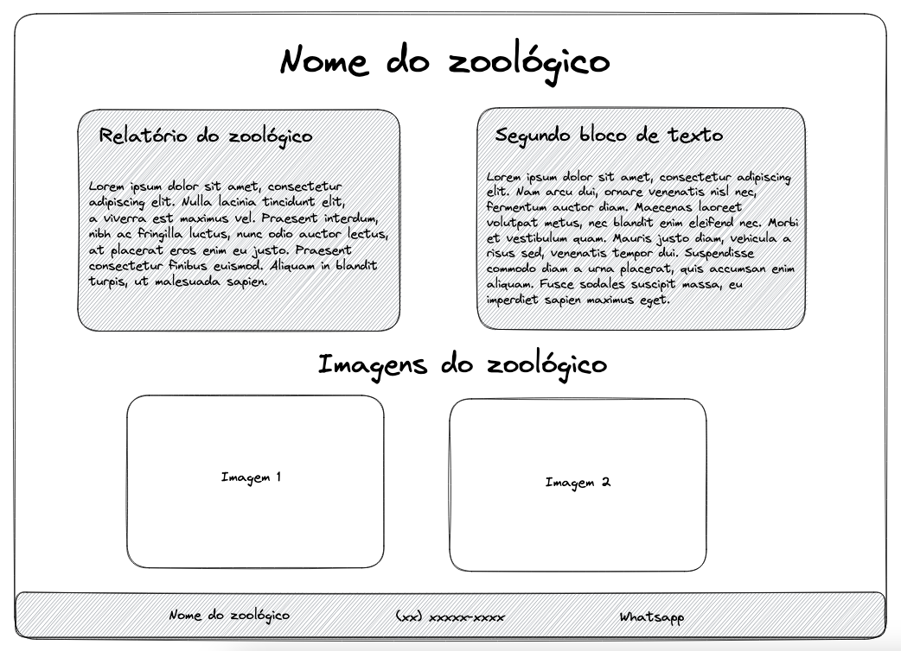

## Atividade - Site zoológico :computer:

### :pencil: Descrição da atividade:

Fazer um site de acordo com o que foi requisitado pela empresa.

### :speech_balloon: Cenário:

Depois do trabalho M-A-R-A-V-I-L-H-O-S-O que vocês fizeram gerando aquele relatório do zoológico, a empresa quis dar um passo além e pedir para que façam um site simples contendo algumas informações sobre o zoológico.

Aqui teremos descrito alguns pontos que esse site deverá ter, mas preste bem atenção.

O e-mail da empresa tem tudo que será necessário no site, mas o planejamento é responsabilidade sua e você precisa separar cada item a ser feito, fazendo uma certa divisão, ou seja, coloque o passo 1, passo 2... Assim como temos feito na duas últimas atividades da Academia de Lógica.

Por exemplo:

```
Passo/Requisito 1: Criar cabeçalho do site

Passo/Requisito 2: .....
```

### E-mail da Cliente: :email:

```
Olá, boa tarde!
Meu nome é Morgana e preciso de um site para meu zoológico, além do ultimo relatório que você fez irei precisar de algumas informações no meu site! 

Preciso de dois blocos de texto, o primeiro contendo o relatório dos animais e o outro com informações do Zoológico, mas depois eu coloco, deixa um texto qualquer por enquanto!

Quero um site com o nome do meu zoológico, que é Animals Zoo. Só que precisa ser bem lá no topo do site, sabe?

Vou deixar duas imagens aqui pra você colocar uma do lado da outra também, em uma seção de imagens do zoológico.

Ah, e no final do meu site eu vou querer de novo o nome do zoológico, o telefone de contato e também um link que ira redirecionar para o meu whatsapp!
Por enquanto, pode deixar informações genéricas no telefone e no link, depois eu troco.

Além das duas fotos que comentei antes, também vou enviar uma terceira, com um esboço de como eu quero meu site mais ou menos.

Confere por lá como quero o site, por gentileza. Tenho certeza que fará um ótimo trabalho, e estou ansiosa para verificar o resultado no repositório que irá compartilhar comigo depois :)

Obrigada!
````



Obs: Os arquivos estão na mesma pasta dessa atividade, dentro da pasta `img/`.

------------

### Depois dessa divisão de "requisitos” vamos para a prática! 

- Crie um repositório no github, chamado site-zoologico.
- **Adicione um README a esse repositório**.
- Clone esse repositório.
- Crie um arquivo `index.html` e comece o site da cliente.
