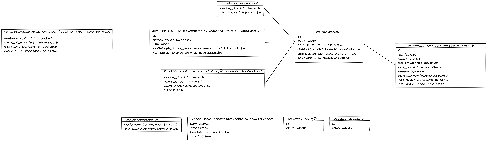

# :city_sunset: Boas-vindas a Trybe City :city_sunset:

### Nossa cidade precisa de sua ajuda, tevemos um assassinato em Trybe City e precisamos de pessoas experientes em SQL para resolverem esse crime intrigante.

## Vamos aos fatos! :shipit:
Um crime ocorreu e o detetive precisa de sua ajuda. O detetive deu a você o relatório da cena do crime, mas de alguma forma você o perdeu. :sweat_smile: Você lembra vagamente que o crime foi um homicídio **ocorrido em 15 de janeiro de 2018** e que ocorreu em **Trybe City**. Comece recuperando o **relatório da cena do crime** correspondente do banco de dados do departamento de polícia.

## Explorando a estrutura do banco de dados :mag_right:
Usuários experientes de SQL geralmente podem usar consultas de banco de dados para inferir a estrutura de um banco de dados. Mas cada sistema de banco de dados tem maneiras diferentes de gerenciar essas informações.

Use este comando SQL para encontrar as tabelas do banco.

~~~sql
SHOW TABLES;
~~~

Além de conhecer os nomes das tabelas, você precisa saber como cada tabela está estruturada. A maneira como isso funciona também depende de qual tecnologia de banco de dados você usa.

Use este comando SQL para encontrar a estrutura da tabela.

~~~sql
SELECT *
FROM INFORMATION_SCHEMA.COLUMNS 
WHERE TABLE_SCHEMA = 'trybecity' AND TABLE_NAME ='crime_scene_report';
~~~

## Diagrama :page_facing_up:
Para auxiliar nas buscar temos o diagrama do banco de dados.

## :warning: Instruções para o desafio :warning:

#### Restaurar o banco de dados
- Abra o MySQL Workbench.
- Abra o script `dump.sql` que contém dentro do projeto.
- Depois clique no ícone de raio para executar a query.
- Aguarde alguns segundos (espere em torno de 30 segundos antes de tentar fazer algo).
- Clique no botão :arrows_counterclockwise: `Refresh da aba Schemas` para atualizar a listagem de banco de dados.
- Verifique se a estrutura possui todas as tabelas informadas no diagrama anterior.

## Verificando sua solução :white_check_mark:
Você encontrou o assassino(a)?

Use o seguinte comando para validar sua hipótese:

Troque `Nome encontrado` pela pessoa que você encontrou.

~~~sql
INSERT INTO accused(value) VALUES ('Nome encontrado');

SELECT value FROM solution ORDER BY id DESC LIMIT 1;
~~~

**Se o retorno da query for vazia você ainda não encontrou o assassino(a).**

## Agora é com você! :rocket:
Use seu conhecimento do esquema do banco de dados e dos comandos SQL para descobrir quem cometeu o assassinato. Boa sorte!

## Dica

Sabemos que o assassinato aconteceu:
 - Em `15 de janeiro de 2018`
 - Na cidade `Trybe City`

Com essas informações podemos vasculhar a `crime_scene_report` para encontrar nossas testemunhas.
